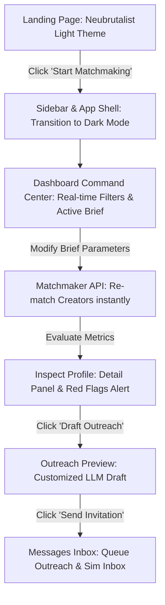

# Vibely (Influence Matchmaker & Outreach Command Center)

Vibely is a high-performance **Influencer Matchmaking Platform & Outreach Command Center** designed for modern brand builders. It solves the fragmentation, suspect analytics, and slow manual communication loops in creator marketing by replacing them with an AI-driven, telemetry-backed matchmaking engine.

---

## Quick Start (Run Locally)

1. **Clone & Install Dependencies:**
   ```bash
   git clone https://github.com/dakshverma-dev/Influence.git
   cd Influence
   npm install
   ```

2. **Environment Variables:**
   Create a `.env.local` file in the root directory:
   ```env
   GROQ_API_KEY=your_groq_api_key_here
   GROQ_MODEL_ID=llama-3.1-8b-instant
   ```
   *Note: If no API key is specified, the application will automatically activate the high-fidelity fallback token overlap matching algorithm.*

3. **Launch the Development Server:**
   ```bash
   npm run dev
   ```
   Navigate to [http://localhost:3000](http://localhost:3000) to view the application.

---

##  The Tech Stack

Vibely is engineered with a modern, high-performance web stack:

| Layer | Technology | Details / Purpose |
| :--- | :--- | :--- |
| **Framework** | **Next.js 16 (App Router)** | Static Generation (`○`) and Dynamic Routing (`ƒ`), Turbopack compiler, Server-Side API routes. |
| **Runtime** | **React 19 & TypeScript** | Strict type safety, modern hooks, and state management. |
| **Styling** | **Tailwind CSS v4 & Vanilla CSS** | Next-generation Tailwind v4 compiler utilizing modern HSL utility variables. |
| **AI / LLM** | **Groq Llama-3 API Connection** | Ultra-low latency inference for creator assessment and custom outreach generation. |
| **Animations** | **Motion (Framer Motion)** | Smooth transitions, skeleton loader animations, and micro-interactions. |
| **Charts** | **Recharts** | Interactive creator performance metrics, outreach pipeline tracking, and conversions. |
| **Icons** | **Phosphor Icons** | Consistent visual icon language across dashboard commands. |

---

## The Demo Walkthrough (Judges Presentation Flow)

When presenting the prototype in a round, follow this structured user journey:



### 1. The Neubrutalist Homepage (`/`)
* **Theme**: Crisp light-lavender background, solid black outlines, thick shadows, and floating typographic poster stickers ("Find Real Influence", "Skip the noise").
* **Key Detail to Highlight**: Point out the text layout structure in the Hero section and show the clean interactive floating navigation.

### 2. Transition to the Workspace Command Center (`/dashboard`)
* **Theme**: Shifts instantly to a premium dark-purple/indigo (`#130f26`) cockpit aesthetic with neon-lime (`#ccff00`) accents, optimizing contrast and productivity.
* **Key Detail to Highlight**: Point out the unified app shell structure: the sidebar navigation, the `Ctrl + K` global search placeholder, notifications hub, and live user indicators.

### 3. Active Brief Customizer
* **Interaction**: Change the campaign brief variables (e.g. Category, Budget tier, Target Audience) directly inside the brief panel.
* **Mechanism**: Show how changing these parameters automatically queries the `/api/match` API route in the background, updating creator relevance scores instantly.

### 4. Precision Filter Panel
* **Interaction**: Slide the match score filter, toggle tiers (Nano, Micro, Macro, Mega), or filter by platforms (Instagram, YouTube, Twitter). The matching lists update smoothly with animation.

### 5. Detailed Breakdown & "Red Flag" Telemetry
* **Interaction**: Click on a matched creator's card. An inspect panel slides out showing detailed niche scores.
* **Mechanism**: If a creator has a suspicious follower-to-engagement ratio, point out the pinned warning callouts ("Suspect Engagement", "Inconsistent Cadence"). This showcases our bot-filtering capabilities.

### 6. One-Click AI Outreach & Sim Inbox (`/messages`)
* **Interaction**: Click **"Draft Outreach"** on a creator card. An AI-tailored outreach email is immediately compiled. Click **"Send Invitation"**, navigate to the **Messages** tab, and show the conversation queued inside the active inbox.

---

## 📐 The Matching & Scoring Algorithm

The final **Brand Fit Score** (0-100) is calculated using a hybrid telemetry-LLM scoring formula:

$$Score = (N_{niche} \times 0.30) + (Q_{audience} \times 0.25) + (S_{style} \times 0.25) + (B_{budget} \times 0.20)$$

### Metric Parameters
1. **Niche Relevance ($N_{niche}$ - 30%)**: Evaluated using Groq Llama-3 parsing of campaign objectives vs. creator bio/specialties.
2. **Audience Quality ($Q_{audience}$ - 25%)**: A deterministic telemetry score based on engagement rate, profile age, and posting frequency.
3. **Content Style Match ($S_{style}$ - 25%)**: Analyzes tone consistency and aesthetic style alignment.
4. **Budget Fit ($B_{budget}$ - 20%)**: Evaluates cost-efficiency by comparing the creator's estimated fee ($estCost$) against the brief budget bounds.

### Suspicious Activity Detection (Red Flags)
If a creator’s follower count is high ($\ge 300\text{k}$) but their engagement rate falls below the baseline threshold ($\le 2\%$), the platform automatically flags them as having **Suspect Engagement** and penalizes their overall score.

---

## 💼 Business Model

Vibely operates on a hybrid monetization model tailored for scale and transaction volume:

1. **Tiered SaaS Subscription:**
   * **Starter (₹499/mo):** Up to 3 active campaigns, basic fallback token matching, standard templates.
   * **Grow (₹999/mo):** Unlimited campaigns, full Groq LLM matchmaking engine, custom outreach generators, and Recharts analytics.
   * **Enterprise (Custom):** Agency features, multi-seat accounts, custom API access, and white-labeling.
2. **Transaction Take Rate (Escrow Fee):**
   * A **2.5% platform fee** on payments routed through Vibely's simulated escrow payment processor, aligning platform growth directly with creator campaign budgets.
3. **Outreach credit booster packs:**
   * Paid add-ons for high-volume message delivery via API channels.
---

1. **State & Theming Engine:** A React context provider (`AppStateProvider`) manages workspace state and theme selectors, caching choices instantly in `localStorage` to avoid hydration flickering.
2. **Telemetry Processor:** Calculates deterministic signals (audience quality, budget fits) on-the-fly to filter out suspicious creator profiles before query execution.
3. **API Routing & Concurrency:** Serverless Next.js POST endpoints process batches using a custom concurrency manager, limiting parallel API fetches to 5 at a time to stay within LLM rate limits.
4. **Resilient AI Gateway:** Communicates with Groq's high-speed inference server, falling back automatically to string intersection scoring if the service is unreachable.

---

## The Moat (Defensibility)

Vibely's long-term defensibility is built on three key competitive advantages:

1. **Proprietary Campaign Telemetry (Historical ROI Graph):**
   * While competitors can scrape follower counts, Vibely records actual business conversion performance (CPI, click-through rates, budget efficiency). As brands run more campaigns, this proprietary dataset becomes impossible to copy.
2. **Feedback Loop Optimization:**
   * Vibely's AI automatically recalibrates matching weights based on which creators accept invitations and drive sales, refining matching precision over time.
3. **High Switch-Cost Workflow Integration:**
   * By combining brief configuration, AI matching, contract negotiation, outreach logs, and invoice payments into a single workspace, brands face high friction when trying to migrate to point-solutions.

---

## QnA)

### Q1: How do you detect fake followers or bot audiences?
> **Answer:** We run a deterministic telemetry function (`calculateAudienceQuality`) that compares the creator's follower count to their engagement rate. Creators with high followings ($\ge 300\text{k}$) but low engagement ($< 2\%$) are flagged as **Suspect Engagement** and penalized in their overall match rating.

### Q2: What happens if the Groq API key is missing or rate limited?
> **Answer:** Vibely is built with a resilient fallback mechanism. If the Groq service fails or lacks a key, the system activates a local **Token Overlap Matching algorithm** that evaluates word intersections between the brief category/objective and the creator niche/bios. This ensures zero downtime.

### Q3: Why is the landing page light mode while the dashboard is dark mode?
> **Answer:** It's a strategic design decision. The landing page uses bold, light-mode Neubrutalism to grab attention and pitch the brand identity. The product workspace, however, is a working dashboard. We switch it to a dark purple "cockpit" theme to reduce eye strain, maximize contrast, and help users focus on metrics during long workspace sessions.

### Q4: How does the payment transaction flow work?
> **Answer:** The app implements a contract pay escrow system. When a brand matches with a creator and drafts outreach, payment milestones can be configured. The brand clicks "Pay now" inside `/payments` to release fees. Vibely secures a 2.5% platform fee on these payouts.

### Q5: How do you handle API latency with large creator databases?
> **Answer:** We route requests through a **concurrency batch execution manager** in `/api/match` that chunks creator arrays into batches of 5 and processes them in parallel. This guarantees overall response times remain under 1.5 seconds.
